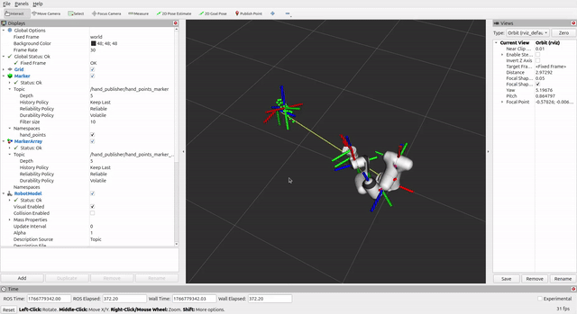
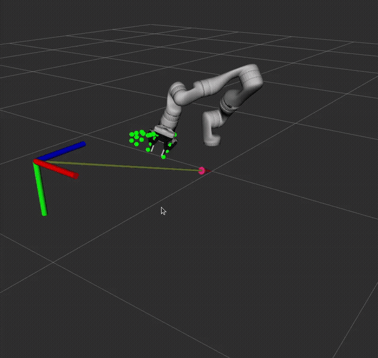

# ROS2 hand teleoperation from webcam





TL;DR: Webcam => MediaPipe landmarks => 3D hand pose => TF => IK => robot joint states in RViz.

## What's going on:
- `hand_image_node` - use opencv to capture webcam footage in 1280x720
- `hand_points_node` - subscribe to the image published in the above node and plug the feed into mediapipe hand landmark detection
- `hand_publisher_node` - subscribe to aforementioned landmarks and publish 3D estimate of the points
- `hand_frame_node` - extract transform from the hand point positions and publish the transform w.r.t. the camera frame that is also defined in this node
- `controller_node` - take the hand transform and publish a `PoseStamped` for inverse kinematics
- `trac_ik_node` - use the `trac_ik` package to perform inverse kinematics every time the hand pose is published and publish joint states
- `joint_state_merger` - joins the joint states - main joints for inverse kinematics, and the rest for the gripper joint
- `gripper_publisher` - takes in hand points and determines whether the gripper should be open or closed

## How to launch
- `python utils.py build` - build the project
- `python utils.py run` - run the project
- `python utils.py clean` - remove the log & install & build directories (sometimes needed when build fails)
- `python utils.py clean build run` - all of the above
- `python utils.py run robot:=panda` - run with panda robot instead of kinova (no gripper atm)

### Requirements:
- Tested on Ubuntu 24.04, Python 3.12.3, ROS2 Jazzy, acer nitro laptop
- `sudo apt install ros-${ROS_DISTRO}-trac-ik`
- `pip install -r requirements.txt`

### Specs
- Distance estimate done using symbolic regression:
  - `dists = list(segment dist on each finger)`
  - `mean_dist = mean(dists)`
  - distance: `D*(B/(A * np.mean(finger digit segment length (each finger, each segment)))**C)`
    - A,B,C,D estimated by trial and error
- Effective range: 30-90 cm +-1 cm (for my hand)
- Speed: 5-10 FPS

### Topics:
```
/clicked_point
/goal_pose
/gripper_joint_states
/hand_publisher/finger_dist
/hand_publisher/hand_points
/hand_publisher/hand_points_corrected
/hand_publisher/hand_points_marker
/hand_publisher/hand_points_marker_array
/hand_publisher/webcam
/ik_target
/initialpose
/joint_states
/joint_states_merged
/parameter_events
/robot_description
/rosout
/tf
/tf_static
```

### Launching rviz2 independently
- `unset GTK_PATH`
- `ros2 run rviz2 rviz2`

### Future work
- smoothing of movements, better position estimates
- moveit integration
- source better urdf/xacro representations
- integrating physics with Gazebo or other
- make hand teleoperate a an action server
- rewrite in CPP to speed things up
